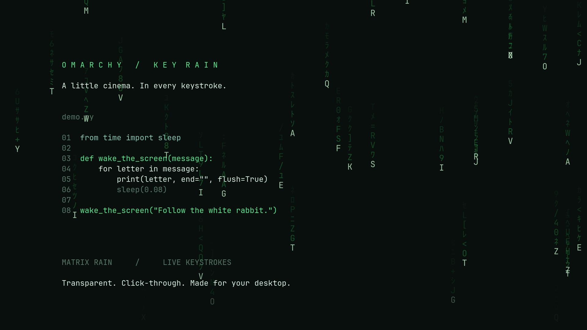

# Key Rain for Omarchy

*A little cinema. In every keystroke.*



Previously called Falling Keys. The internal plugin ID and IPC commands remain
unchanged, so existing settings and shortcuts continue to work.

An Omarchy bar widget with an enable/disable control, layout selection, and a
keyboard-free animation preview. Matrix rain and Cascade are included.
The head shows the pressed key; each fading trail character independently
cycles through letters, digits, katakana, and symbols every 80–200 ms.
Each key press creates one drop. Holding a key does not create additional
drops; release and press it again to create another.

The header switch enables/disables the effect. Follow theme uses Omarchy's
live foreground color for key heads and accent color for trails; switch it
off to use classic Matrix green. Split keyboard places physical QWERT /
ASDFG / ZXCVB letter positions on the left half, and YUIOP / HJKL / NM on
the right, independent of the active language. Number-row, numpad, and other
non-letter positions retain full-screen placement. Both options and the
animation layout persist together in the widget's inline shell settings.
Tab and Space operate panel controls; Escape closes the panel. The panel
uses the native Omarchy hero, switches, toggle rows, and style tokens, with
scrolling when the available height is too small.
Font size uses three presets: Small (16 px), Medium (22 px, the original
size), and Large (30 px). Font size persists with the other preferences and
applies immediately. Column spacing and trail spacing scale with the glyphs.
Opacity uses a native slider with a percentage readout, ranging from 10% to
100% of the original effect strength. It adjusts heads and trails together,
applies while dragging, and saves when released. Mouse wheel or arrow keys
adjust it in 5% steps; Home and End select the endpoints. The panel itself
keeps its normal opacity. The default is 100%.
Fall height uses a second slider (10–100% of each screen's height). At 50%,
the pressed letter disappears halfway down the screen. The entire stream
smoothly fades over the final 20% of its travel and is removed at the chosen
endpoint. This works with both animation layouts and all font/opacity
settings. Changes apply immediately and save when released.

The animation uses a transparent Wayland overlay with `mask: Region {}` and
`WlrKeyboardFocus.None`. It does not intercept clicks, scrolling, or typing.
The control popup is interactive while open, like other bar panels.

The effect starts disabled in each shell session. Enabling launches a small
`pkexec` keyboard reader and may require authentication. It reads keyboard
events without grabbing devices; it never records them to disk. Disabling
closes the reader and clears particles. Ctrl+Alt+Esc also disables it, and
the plugin checks Omarchy's lock state and disables when the screen locks.
Pause before entering passwords in applications: these are global keystrokes.

## Install and update

Requires Omarchy with the plugin API and Hyprland's `solitaryBlockedBy` monitor
state, Python 3, GCC, pkgconf, libxkbcommon, and polkit (`pkexec`). The compiler
and xkb headers are needed locally; no dependencies are downloaded by the plugin.
Install missing Arch packages with Omarchy's package manager before continuing.

Download or clone [omarchy-key-rain](https://github.com/dfrost90/omarchy-key-rain),
then run these commands from its source directory as your normal desktop user:

```sh
python3 install.py
omarchy-shell shell rescanPlugins
omarchy plugin enable io.github.dfrost90.falling-keys
```

A plugin installed directly into Omarchy's plugin directory also builds its
reader locally when first enabled. Build failures are shown in the panel;
run `python3 backend.py build` in that directory for diagnostics.
Updates to live service code require `omarchy restart shell`. Existing display
preferences remain saved, and input reading starts disabled after a restart.

## Remove

Disable input reading, then remove the plugin through Omarchy:

```sh
omarchy-shell falling-keys disable
omarchy plugin disable io.github.dfrost90.falling-keys
```

Remove the directory `~/.config/omarchy/plugins/io.github.dfrost90.falling-keys`
(or its equivalent under `$XDG_CONFIG_HOME`) and run
`omarchy-shell shell rescanPlugins`. There are no system files, services, or
privilege rules to remove. Remove any remaining bar entry in Omarchy's bar editor.

## Development

Tests additionally require Node.js for layout checks.
Run `python3 tests/check.py` for reader state, JSON, lock-state, and layout tests.
Run `omarchy plugin validate .` for installed-host manifest validation.
The source release excludes compiled binaries and local audit screenshots.
See [SECURITY.md](SECURITY.md) for privilege and lock-transition limitations.
Licensed under [MIT](LICENSE).

Source files:

- `Service.qml`: one reader and shared controls for all monitors.
- `Rain.qml`: particle animation. Add new rendering layouts here and register
  their names in `Service.qml`'s `layouts` array.
- `Layouts.js`: physical keyboard halves and bounded drop positions.
- `BarWidget.qml`: the bar button and control panel. Layout selection persists
  in the widget's inline entry in Omarchy's `shell.json`.
- `reader.c`: bounded event reader, xkb layout handling, hotplug discovery,
  JSON output, and stdin lifetime management.
- `backend.py`: unprivileged local compilation and compositor lock monitoring.

IPC controls: `omarchy-shell falling-keys preview`, `enable`, `disable`,
`status`, or `setLayout cascade`.

Current limits: rendering runs at 30 FPS, with at most 96 particles per
monitor. Keyboard settings are read when enabling; disable/re-enable after
changing the configured layouts. IME composition and per-device keyboard
overrides are not tracked. Switching layouts while enabled is handled by
the configured xkb switching shortcut.
